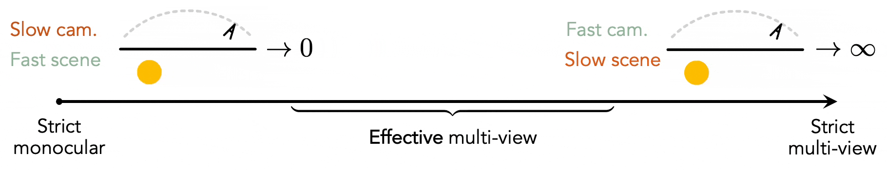
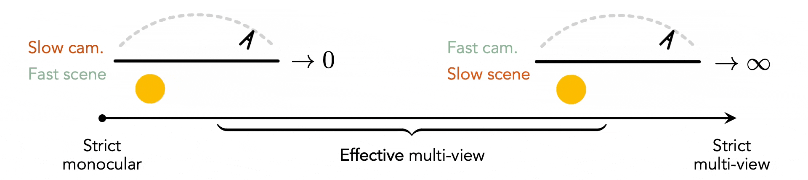
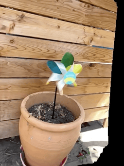

# Monocular Dynamic View Synthesis: A Reality Check

### [Paper](https://arxiv.org/abs/2210.13445) | [Project Page](https://hangg7.com/dycheck) | [Video](https://www.youtube.com/watch?v=WwESsNivJP8&t=21s) | [Data](https://drive.google.com/drive/folders/1ZYQQh0qkvpoGXFIcK_j4suon1Wt6MXdZ?usp=sharing)

<p align="left">
    
</p>

This repo contains training, evaluation, data processing and visualization code in JAX for our reality check on the recent advances in Dynamic View Synthesis (DVS) from monocular video.
Please refer to our project page for more visualizations and qualitative results.

> [**Monocular Dynamic View Synthesis: A Reality Check**](https://arxiv.org/abs/2210.13445) <br> [Hang Gao](https://people.eecs.berkeley.edu/~hangg/),
> [Ruilong Li](https://www.liruilong.cn/),
> [Shubham Tulsiani](https://shubhtuls.github.io/),
> [Bryan Russell](https://bryanrussell.org/),
> [Angjoo Kanazawa](https://people.eecs.berkeley.edu/~kanazawa/)<br>
> UC Berkeley, CMU, Adobe Research<br>
> NeurIPS 2022

We find that though existing works have shown impressive results, there exists a discrepancy between the practical captures, for which we hope to develop, and the common experimental protocols, which are _effectively_ multi-view. Also, we find that existing evaluation protocols are also limitted as they have not consider the co-visibility of pixels during training and testing, as well as inferred correspondence. We benchmark the existing works under the practical setting using our improved evaluation scheme and show that there is a large room for improvement. We hope that our work can provide a solid baseline for future works in this domain.

<p align="center">
    
</p>

In this repository, you can find:

- [Our new iPhone dataset of casually captured diverse and complex real-life dynamics, along with its data processing scripts](#datasets).
- [Benchmark results for existing works under the practical setting and their checkpoints](benchmark).
- [Python APIs and scripts for computing effective multi-view factors (EMFs) for quantifying multi-view cues given an input video](#effective-multi-view-factors-emfs).
- [Evaluation code for co-visibility masked image metrics and correspondence metrics](#better-evaluation-metrics).
- [Unified JAX implementation of T-NeRF, Nerfies and HyperNeRF with several training enhancement](dycheck/models).

## Setup

Please refer to [SETUP.md](docs/SETUP.md) for instructions on setting up a work environment.

By default, our code runs on 4 NVIDIA RTX A5000 GPUs (24 GB memory). Please try decreasing the chunk size if you have fewer resources. You can do so by the following syntax for all of demo/evaluation/training code:

```bash
# Append rendering chunk at the end of your command. Set it to something
# smaller than the default 8192 in case of OOM.
... --gin_bindings="get_prender_image.chunk=<CHUNK_SIZE>"
```

## Quick start

Here is a demo to get you started: re-rendering a paper-windmill video from a pre-trained T-NeRF model. Under the `demo` folder, we include [a minimal dataset](./demo/datasets/iphone/paper-windmill) and [a model checkpoint](demo/work_dirs/iphone/paper-windmill/tnerf/randbkgd_depth_dist/checkpoints) for this purpose.

```bash
# Launch a demo task.
python demo/launch.py --task <TASK>
```

You should be able to get the results below by specifying `<TASK>=...`:

<table width="100%">
    <tr align=center>
        <td width="24%"></td>
        <td width="24%"></td>
        <td width="24%"></td>
        <td width="24%"></td>
    </tr>
    <tr align=center>
        <td width="24%"><b>Training video</b></td>
        <td width="24%"><code>"novel_view"</code></td>
        <td width="24%"><code>"stabilized_view"</code></td>
        <td width="24%"><code>"bullet_time"</code></td>
    </tr>
</table>

<details>
<summary>Click to see additional details.</summary>

- The minimal dataset only contain the camera and meta information without the actual video frames.
- The model is our baseline T-NeRF with additional regularizations ([config](configs/iphone/tnerf/randbkgd_depth_dist.gin)) which we find competitive comparing to SOTA methods.
- It takes roughtly 3 minutes to render for novel-view task and 12 minutes for the others at 0.3 FPS.

</details>

## Datasets

Please refer to [DATASETS.md](docs/DATASETS.md) for instructions on downloading processed datasets used in our paper, including:

1. Additional co-visibility masks and keypoint annotations for Nerfies-HyperNeRF dataset.
2. Our accompanying iPhone dataset with more diverse and complex real-life motions.

For processing your own captures following our procedue, please see [RECORD3D_CAPTURE.md](docs/RECORD3D_CAPTURE.md).

## Benchmark

Please refer to [BENCHMARK.md](docs/BENCHMARK.md) for our main results and instructions on reproducibility, including:

1. How to evaluate our released checkpoints.
2. How to train from scratch using our configurations.

## Effective Multi-view Factors (EMFs)

For better transparency on the experiments, we recommend future works to report their EMFs on their new sequences.

We propose two EMFs: Angular EMF and Full EMF. The first one is easy to compute but assumes there's a single look-at point of the sequence. The second one is generally applicable but uses optical flow and monocular depth prediction for 3D scene flow estimation and is thus usually noisy. We recommend trying out the Angular EMF first whenever possible.

### (1) From our python APIs

```python
from dycheck import processors

# Angular EMF (omega): camera angular speed. We recommend trying it out first whenever possible.
angular_emf = processors.compute_angular_emf(
    orientations,   # (N, 3, 3) np.ndarray for world-to-camera transforms in the OpenCV format.
    positions,      # (N, 3) np.ndarray for camera positions in world space.
    fps,            # Video FPS.
    lookat=lookat,  # Optional camera lookat point. If None, will be computed by triangulating camera optical axes.
)

# Full EMF (Omega): relative camera-scene motion ratio.
full_emf = processors.compute_full_emf(
    rgbs,           # (N, H, W, 3) np.ndarray video frames in either uint8 or float32.
    cameras,        # A sequence of N camera objects.
    bkgd_points,    # (P, 3) np.ndarray for background points.
)
```

Please see the [camera definition](https://github.com/KAIR-BAIR/dycheck/blob/main/dycheck/geometry/camera.py#L244-L282) in our repo, which follows the one in Nerfies. Note that additional care needs to be taken due to camera distortion, e.g. during [camera projection](https://github.com/KAIR-BAIR/dycheck/blob/main/dycheck/geometry/camera.py#L143-L241).

### (2) From our script

To use our repo as a script that takes a video as input, given that the dataset is preprocessed in Nerfies' data format. Note that you will need to also write a process config at `configs/<DATASET>/process_emf.gin`. Take a look at our [example](configs/iphone/process_emf.gin).

```bash
python tools/process_emf.py \
    --gin_configs 'configs/<DATASET>/process_emf.gin' \
    --gin_bindings 'SEQUENCE="<SEQUENCE>"'
```

## Better evaluation metrics

### (1) Co-visibility masked image metrics

Have a look on our [masked image metrics](dycheck/core/metrics/image.py) which besides taking in a pair of predicted and ground-truth images `(img0, img1)` as input, also consider an optional co-visible `mask`.

```python
# Consider computing SSIM and LPIPS for example.
from dycheck.core import metrics

# Masked SSIM using partial conv.
mssim = metrics.compute_ssim (
    img0,           # (H, W, 3) jnp.ndarray image in float32.
    img1,           # (H, W, 3) jnp.ndarray image in float32.
    mask,           # (H, W, 1) optional jnp.ndarray in float32 {0, 1}. The metric is computed only on the pixels with mask == 1.
)

# Masked LPIPS.
compute_lpips = metrics.get_compute_lpips()  # Create LPIPS model on CPU. We find it is fast enough for all of our experiments.
mlpips = compute_lpips(
    img0,           # (H, W, 3) jnp.ndarray image in float32.
    img1,           # (H, W, 3) jnp.ndarray image in float32.
    mask,           # (H, W, 1) optional jnp.ndarray in float32 {0, 1}. The metric is computed only on the pixels with mask == 1.
)
```

You can use our pre-computed co-visibility mask or process yourself. We provide a [process script](tools/process_covisible.py) for your reference. Note that you will need a process config at `configs/<DATASET>/process_covisible.gin`. Take a look at our [example](configs/iphone/process_covisible.gin).

```bash
python tools/process_covisible.py \
    --gin_configs 'configs/<DATASET>/process_covisible.gin' \
    --gin_bindings 'SEQUENCE="<SEQUENCE>"'
```

### (2) Correspondence metrics

```python
from dycheck.core import metrics

pck = metrics.compute_pck (
    kps0,           # (J, 2) jnp.ndarray keypoints in float32.
    kps1,           # (J, 2) jnp.ndarray keypoints in float32.
    img_wh          # (Tuple[int, int]) image width and height.
    ratio,          # (float) threshold ratio.
)
```

In this repo, we use root-finding for determining the long-term correspondence given a Nerfies or HyperNeRF checkpoint. See our [canonical-to-view snippet](https://github.com/KAIR-BAIR/dycheck/blob/main/dycheck/models/warping/dense.py#L153-L188) for reference.

## Citation

If you find this repository useful for your research, please use the following:

```txt
@inproceedings{gao2022dynamic,
    title={Dynamic Novel-View Synthesis: A Reality Check},
    author={Gao, Hang and Li, Ruilong and Tulsiani, Shubham and Russell, Bryan and Kanazawa, Angjoo},
    booktitle={NeurIPS},
    year={2022},
}
```

## License

Both our code and dataset are released under the Apache 2.0 license.

## Acknowledgement

This repository is built on top of Keunhong's [hypernerf](https://github.com/google/hypernerf) and [nerfies](https://github.com/google/nerfies) codebases. We also thank [jaxnerf](https://github.com/google-research/google-research/blob/master/jaxnerf) for reference of fast data-loading; [deq-jax](https://github.com/akbir/deq-jax) for Broyden root-finding solver.

We would like to thank Zhengqi Li and Keunhong Park for valuable feedback and discussions; Matthew Tancik and Ethan Weber for proofreading. We are also grateful to our pets: Sriracha, Haru, and Mochi, for being good during capture. This project is generously supported in part by the CONIX Research Center, sponsored by DARPA, as well as the BDD and BAIR sponsors.
